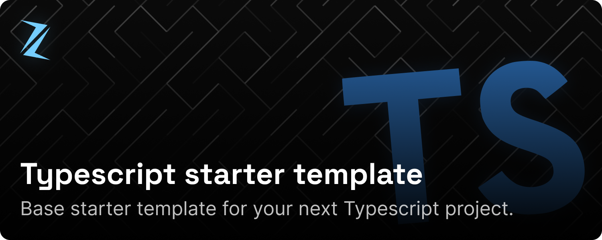
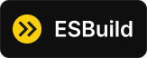
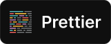
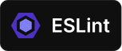

    

        
    

    

        
        
        
        
        
    

# Setup

1. After cloning the repository, make sure you have [pnpm](https://pnpm.io/) installed. If you don't, you can install it by running `npm install -g pnpm`.

2. After that, you can proceed to set up the project by running `pnpm run setup`. This will install all the necessary dependencies and purge the README, LICENSE, and Banner files which are no longer needed.

3. If you're using Visual Studio Code, you can also install the recommended extensions by clicking on the "Install Recommended Extensions" button that appears when you open the project.

4. You're all set! You can now start developing your project.

# Development

If you want to make a production build, you can run `pnpm run prod`. This will create a `dist` folder with the production build of your project.

If you want to make a development build, you can run `pnpm run dev`. This will create a `dist` folder with the development build of your project and will automatically rebuild the project whenever you make changes to the source files.
